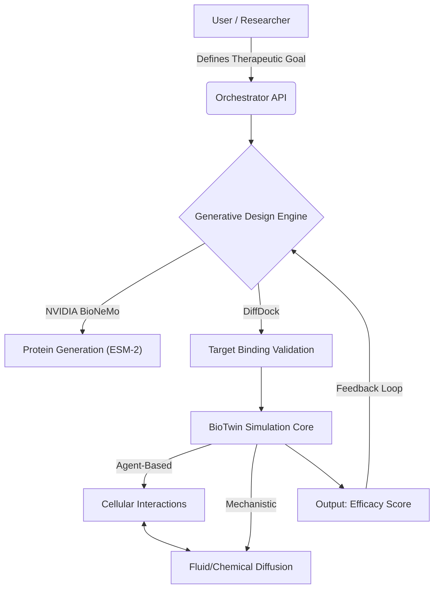

# 🧬 BioTwin-Core: Endocrine Reprogramming & Digital Twin Framework

> **"From treating symptoms to reprogramming physiology."**

**BioTwin-Core** is an open-source computational framework designed to engineer the next generation of regenerative medicine. It integrates **Generative AI (NVIDIA BioNeMo)** with **Multi-Scale Physiological Simulations** to design, test, and validate "Hormokines"—synthetic signaling molecules that reprogram the body's endocrine system to reverse disease states like fibrosis.

---

## 🚀 The Vision

Traditional medicine often relies on exogenous drug delivery. BioTwin proposes a paradigm shift: treating the body as a **Programmable Analog Computer**.
We aim to reconfigure the endocrine system as a "biological cloud" and ribosomes as "compilers", using precise molecular instructions to trigger endogenous healing algorithms.

This repository hosts the **Digital Twin Engine** that allows researchers to:

1. 
**Design** synthetic ligands (Hormokines) using Large Language Models (LLMs).


2. 
**Simulate** their effects on organ tissues (e.g., Liver Lobule) *in silico* before wet-lab trials.


3. 
**Optimize** targeting to minimize off-target effects (spillover).


---

## 🏗 Architecture

BioTwin-Core operates on a modular "Hybrid Modeling" architecture, combining physics-based mechanistic models with AI-driven agent behaviors.



### Key Modules:

* **`src/generative`**: Interface with **NVIDIA BioNeMo**. Handles the generation of *de novo* protein sequences (Hormokines) and structural folding (AlphaFold2).


* **`src/simulation`**: The physiological playground. Currently supports a **Liver Lobule MVP** containing hepatocytes, stellate cells, and blood flow dynamics.


* 
**`src/data_layer`**: Connects to biological atlases (HuBMAP, Human Cell Atlas) to initialize the digital twin with realistic parameters.


---

## 🧠 Integration with NVIDIA BioNeMo

We leverage the **BioNeMo Framework** to solve the "Search Space" problem. Instead of screening millions of existing molecules, we generate purpose-built proteins.

| Task | BioNeMo Model Used | Application in BioTwin |
| --- | --- | --- |
| **Sequence Generation** | **ProtGPT2 / ESM-2** | Creating novel "Hormokine" sequences with specific addressing domains.

 |
| **Structure Prediction** | **AlphaFold2** | Validating that the generated sequence folds into a stable, functional 3D structure. |
| **Docking & Interaction** | **DiffDock** | Ensuring the Hormokine binds *only* to the specific receptor (Lock-and-Key) on the target tissue.

 |

---

## 💻 Getting Started

### Prerequisites

* Linux (Ubuntu 20.04+ recommended)
* NVIDIA GPU (A100/H100 recommended for BioNeMo training; T4/V100 for inference)
* Docker & Docker Compose
* NVIDIA Container Toolkit

### Installation

1. **Clone the Repository**
```bash
git clone https://github.com/BioTwin-Org/BioTwin-Core.git
cd BioTwin-Core

```


2. **Set up Environment Variables**
Create a `.env` file to configure your NVIDIA NGC API Key (required for BioNeMo).
```bash
cp .env.example .env
# Edit .env and add your NGC_API_KEY

```


3. **Launch the Stack**
We use Docker Compose to orchestrate the Simulation Engine and the AI Service.
```bash
docker-compose up -d

```


---

## 🧪 Usage Example: Designing a "Hormokine"

Here is a Python snippet demonstrating how to use BioTwin-Core to generate a candidate molecule for Liver Fibrosis reversal.

```python
from biotwin.generative import BioNeMoClient
from biotwin.simulation import LiverLobuleTwin

# 1. Initialize the AI Client
ai_engine = BioNeMoClient(model="esm2_650m")

# 2. Define the Target Profile (Prompts for the model)
# We want a peptide that binds to TGF-beta receptor but includes a histone inhibitor domain
target_profile = {
    "target_receptor": "TGFBR2",
    "secondary_payload": "HDAC_inhibitor_peptide",
    "constraint": "high_solubility"
}

# 3. Generate Candidate Sequences (In Silico Design)
print("🧬 Generating Hormokine candidates...")
candidates = ai_engine.generate_sequences(target_profile, num_samples=5)

# 4. Initialize the Digital Twin (The Testing Ground)
# Loading a liver lobule in a 'Fibrotic' state
liver_twin = LiverLobuleTwin(state="fibrosis_stage_2")

# 5. Run Simulation
for protein_seq in candidates:
    result = liver_twin.inject_molecule(
        sequence=protein_seq, 
        concentration="10nM", 
        duration="24h"
    )
    
    if result.fibrosis_reduction > 0.15: # >15% reduction
        print(f"✅ Success! Candidate {protein_seq[:10]}... reduced fibrosis markers.")
        break

```

---

## 🗺 Roadmap

* 
**Phase 0 (Current):** Theoretical foundation and V0.1 Digital Twin of a Liver Lobule. Integration with BioNeMo for basic sequence generation.


* **Phase 1:** Proof of Concept in "Endocrine Switch" models. Validation of *in silico* predictions against *in vitro* organoid data.


* 
**Phase 2:** Full integration of multi-organ communication (Adrenal-Heart axis simulation).


---

## 🤝 Contributing

We are building a new medical ecosystem. We need help from:

* **Bioinformaticians & AI Scientists:** To refine our BioNeMo fine-tuning pipelines.
* 
**Synthetic Biologists:** To design standard biological parts for our library.


* **Physiologists:** To validate the mechanistic rules of our Digital Twins.

Please read `CONTRIBUTING.md` for details on our code of conduct and development process.

---

## 📜 Citation & References

If you use BioTwin-Core in your research, please cite:

> *BioTwin-Core: A Framework for Programmable Endocrine Reprogramming.* (2025). GitHub Repository.

Based on the conceptual framework: *"The Body as a Programmable Analog Computer"*.

---

**License:** Apache 2.0